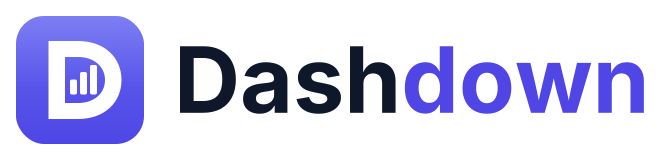
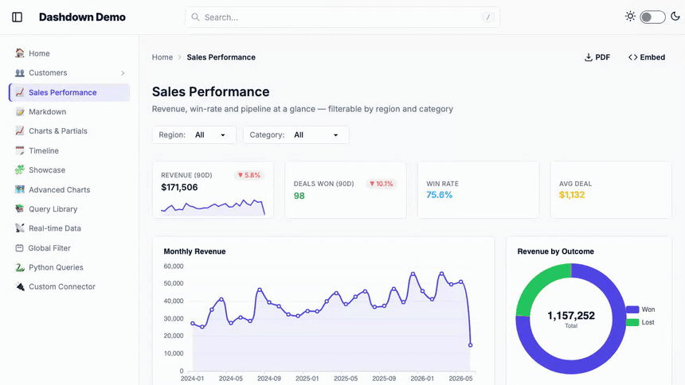

<p align="center">
  <picture>
    <source media="(prefers-color-scheme: dark)" srcset="assets/dashdown-logo-dark.svg">
    
  </picture>
</p>

<p align="center"><strong>Turn Markdown into interactive analytics dashboards.</strong></p>

<p align="center">
  <a href="https://github.com/DirendAI/dashdown/actions/workflows/ci.yml"></a>
  <a href="https://DirendAI.github.io/dashdown/"></a>
  <a href="https://pypi.org/project/dashdown-md/"></a>
  <a href="LICENSE"></a>
</p>

<p align="center">
  <a href="docs/assets/dashdown-demo.mp4">
    
  </a>
  <br />
  <sub><b><a href="docs/assets/dashdown-demo.mp4">▶ Watch the full 60-second tour</a></b> — Markdown&nbsp;+&nbsp;SQL → a live, filterable dashboard</sub>
</p>

Write a `.md` file with some SQL and a few component tags. Dashdown serves it as a
live, interactive dashboard — no JavaScript to write, no frontend toolchain.

```markdown
:::query name=monthly_sales connector=main
SELECT month, SUM(amount) AS revenue
FROM sales GROUP BY month ORDER BY month
:::

# Sales

<Counter data={monthly_sales} column="revenue" label="Revenue" format="currency" />
<LineChart data={monthly_sales} x="month" y="revenue" title="Monthly Revenue" />
```

That's a complete dashboard page — a KPI card and a chart, backed by a real query.
Point the CLI at the folder and it's live in your browser.

---

## Quickstart

```bash
pip install dashdown-md          # Python 3.10+
# or, with uv:
uv tool install dashdown-md      # install the CLI globally
# or run it without installing:  uvx --from dashdown-md dashdown new my-dashboard

dashdown new my-dashboard     # scaffold a project
dashdown serve my-dashboard   # → http://localhost:8000
```

Drop a CSV in `data/`, write `.md` files in `pages/`, and edit live — the dev
server hot-reloads as you save.

---

## Why Dashdown

- **It's just Markdown.** Author dashboards in plain `.md` — prose, headings,
  callouts, and Mermaid diagrams sit right next to your charts. Version them in
  git, review them in a PR — or hand the folder to a coding agent and let it
  write them (see [Built for coding agents](#built-for-coding-agents)).
- **SQL is the API.** Embed queries inline or share them from a `queries/`
  library. `${param}` placeholders wire filters to SQL with context-aware,
  injection-safe substitution — and the SQL never ships to the browser.
- **No frontend to build.** No webpack, no Node, no framework to learn. The
  frontend is hand-written ES modules served as static files; you write Python
  and Markdown.
- **Fast by design.** Pages render instantly with no data, then the browser
  fetches each query asynchronously. Filters update the URL and re-fetch only
  what changed.
- **Runs offline.** ECharts, Alpine, Tailwind/DaisyUI, fonts — all self-hosted.
  Zero external requests, works air-gapped.

---

## What you can build

- **Charts** — line, bar, pie/donut, scatter, treemap, funnel, radar, gauge,
  heatmap, sankey, candlestick, box plot, violin, map, calendar heatmap, graph,
  sunburst, tree, parallel-coordinates, and more — all via one `<XChart>` tag.
- **KPIs & tables** — `<Counter>` cards with trend sparklines and change badges,
  sortable/paginated `<Table>` with CSV export, inline `<Value>`, drag-and-drop
  `<PivotTable>`.
- **Filters** — `<Dropdown>` (single & multi), `<Search>`, `<DateRange>`,
  `<Toggle>`, plus a project-wide global date filter. They sync to the URL, so
  every dashboard view is shareable.
- **Live data** — mark a query `live` and its components stream fresh results
  over a WebSocket. Works against any connector (it polls).
- **LLM commentary** — `<Ask data={q} ask="What stands out?" />` renders a
  model's answer next to the chart (Mistral, Claude, OpenAI, or OpenRouter).
- **A semantic metric layer** — define measures once in YAML, then
  `<BarChart metric={sales.revenue} by={sales.region} />`.

---

## Built for coding agents

A Dashdown dashboard is just Markdown + SQL + component tags — the ideal medium for a
coding agent to write. A full chart is **one tag**; a query is a few lines of SQL. An
agent can describe a whole dashboard in a handful of lines, so it **builds far more per
token** than hand-coding a UI — and you review a small, plain-text diff in a PR instead
of thousands of lines of JavaScript.

Every project is scaffolded to be agent-ready out of the box:

- **`AGENTS.md`** — a tool-agnostic guide that any agent (Claude Code, Cursor, Codex, …)
  reads on open, so it knows the platform without you explaining it. It's a *map*: a
  cheat-sheet plus a table of contents into per-topic **`references/*.md`** shards, loaded
  only when a task needs them (no 50k-token manual for every edit).
- **A Claude Code skill** — `.claude/skills/dashdown-authoring/` routes a task to the
  right reference and the command that verifies it.
- **Facts from the CLI, not from memory** — the agent checks instead of guessing, so it
  doesn't invent attributes or config keys:

  ```bash
  dashdown components            # introspected attribute catalog for every component
  dashdown check                 # config loads + every page renders?
  dashdown query "SELECT …"      # inspect the real data / schema
  dashdown screenshot /page      # did the chart canvases actually draw? (non-zero if not)
  ```

Already have a project? `dashdown skill` drops the guide in (`--refresh` to update it to
the current release). A static build also publishes **`llms.txt`** / **`llms-full.txt`**
for agent hosts that fetch docs over the network.

**→ [Coding agents](docs/pages/ai/coding-agents.md)** for the full read-edit-verify loop.

---

## Connect to your data

CSV · JSON · Parquet · DuckDB · MotherDuck · PostgreSQL · MySQL/MariaDB ·
SQL Server / Azure SQL · Snowflake · BigQuery · Excel · Google Sheets ·
Microsoft Fabric / Power BI (DAX) · Cube.

```yaml
# sources.yaml
main:
  type: csv
  directory: data
```

Backend drivers install as extras (`pip install 'dashdown-md[postgres]'`), so the
core stays lean. Need something else? Write a connector in a few lines of Python,
or ship it as a pip-installable plugin.

---

## Share it anywhere

- **Static export** — `dashdown build` pre-renders the whole site to plain
  HTML + JSON snapshots. Host it on Netlify, Vercel, GitHub Pages, S3 — no server,
  no Python.
- **PDF** — `dashdown pdf` renders a presentation-quality deck (cover page, one
  widget per row, clean page breaks) via headless Chromium.
- **Embed** — drop any page into Notion, a wiki, or a CMS as an auto-resizing,
  chrome-less iframe, with signed page-scoped tokens when auth is on.
- **Auth** — lock a dashboard behind HTTP Basic or an API key with one config
  block.

---

## Examples

Real, runnable dashboards built with Dashdown — clone one and `dashdown serve` it:

- **[dashdown-csv-demo](https://github.com/DirendAI/dashdown-csv-demo)** — a
  dashboard over plain CSV files, the quickest way to see the basics.
- **[dashdown-excel-demo](https://github.com/DirendAI/dashdown-excel-demo)** —
  charts and tables backed by an Excel workbook.
- **[dashdown-world-cup-demo](https://github.com/DirendAI/dashdown-world-cup-demo)** —
  a richer, multi-page dashboard exploring World Cup data.

---

## Documentation

📖 **Read them online at [direndai.github.io/dashdown](https://direndai.github.io/dashdown/)** — itself a Dashdown site, built and deployed from `docs/` by CI.

The full docs are *themselves* a Dashdown dashboard. Run them locally:

```bash
dashdown serve docs
```

Or read the source under [`docs/pages/`](docs/pages) — getting started,
configuration, writing pages, components, connectors, queries, the semantic
layer, real-time data, filters, formatting, exporting, embedding, auth, and
extending. The `docs/` directory is itself a runnable Dashdown project, so it
doubles as a worked example: `dashdown serve docs`.

---

## Telemetry

Dashdown sends an **anonymous** usage event on `dashdown serve` / `dashdown build`
(Dashdown version + OS only — never your data, queries, paths, or connector names),
so we can see how many people use it. It's on by default and trivial to turn off:

```bash
dashdown telemetry off          # or: DASHDOWN_TELEMETRY=0 / DO_NOT_TRACK=1
```

`dashdown telemetry status` shows exactly what would be sent. See
[`docs/pages/telemetry.md`](docs/pages/telemetry.md) for the full policy.

---

## License

Copyright © 2026 Dirend AI.

Dashdown is **free and open source** under the [GNU AGPL-3.0-or-later](./LICENSE).
Use, modify, and self-host it (including commercially) at no cost; the only
obligation is that users of your version can get its source.

A **commercial license** is available if AGPL doesn't fit — e.g. embedding
Dashdown in a closed-source product. See [LICENSING.md](./LICENSING.md) for the
plain-English breakdown, and [CONTRIBUTING.md](./CONTRIBUTING.md) before opening a PR.
